#Question 1
After applying spatial filtering to an image, you find that the output image looks more blurry than the original image, i.e., some details like sharp edges are lost. Based on this description, the filter applied is most likely to be which of the following types?

[ ] high-pass filter  
[X] low-pass filter  
[ ] band-pass filter  
[ ] band-stop filter  

#Question 2
Which one of the following impulse responses acts a high-pass filter?

[ ] 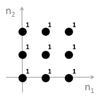  
[ ] 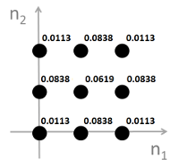  
[X] 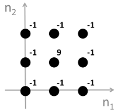  
[ ] 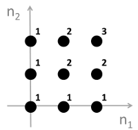  

#Question 3
What is the linear convolution of s<sub>1</sub>(n<sub>1</sub>,n<sub>2</sub>) and s<sub>2</sub>(n<sub>1</sub>,n<sub>2</sub>)? 
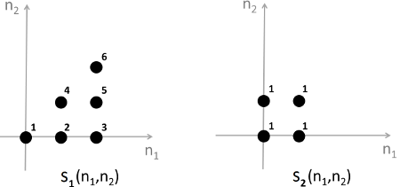  

[ ] 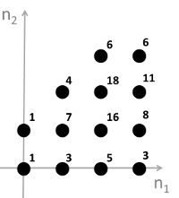  
[X] 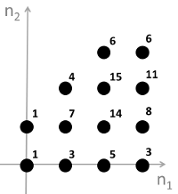  
[ ] 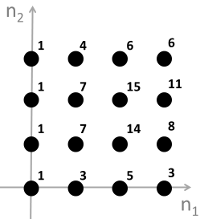  
[ ] none of the above.

#Question 4
A linear shift-invariant system is fully characterizable by its impulse response.

[X] True  
[ ] False  

#Question 5
Check all the statements that apply to any linear shift-invariant system T: 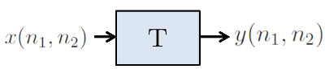  

[X] If the output to x(n<sub>1</sub>,n<sub>2</sub>)=δ(n<sub>1</sub>,n<sub>2</sub>) is known, it is possible to find the output to any other input.  
[X] The output to x(n<sub>1</sub>,n<sub>2</sub>)=ej(ω<sub>1</sub>n<sub>1</sub>+ω<sub>2</sub>n<sub>2</sub>) is always proportional to the input, i.e., y(n<sub>1</sub>,n<sub>2</sub>)=Cx(n<sub>1</sub>,n<sub>2</sub>) where C is a complex constant.  
[ ] It is possible that the zero input (i.e., x(n<sub>1</sub>,n<sub>2</sub>)=0) results in a non-zero output (i.e., y(n<sub>1</sub>,n<sub>2</sub>)≠0).  
[ ] If y(n<sub>1</sub>,n<sub>2</sub>)=0 then x(n<sub>1</sub>,n<sub>2</sub>)=0.  

#Question 6
The regions of support of two images x(n<sub>1</sub>,n<sub>2</sub>) and y(n<sub>1</sub>,n<sub>2</sub>) are given respectively by Sx={(n<sub>1</sub>,n<sub>2</sub>)|0≤n<sub>1</sub>≤P<sub>1</sub>−1,0≤n<sub>2</sub>≤P<sub>2</sub>−1)} and Sy={(n<sub>1</sub>,n<sub>2</sub>)|0≤n<sub>1</sub>≤Q<sub>1</sub>−1,0≤n<sub>2</sub>≤Q<sub>2</sub>−1)}. Which of the following statements is true regarding the linear convolution of x(n<sub>1</sub>,n<sub>2</sub>) and y(n<sub>1</sub>,n<sub>2</sub>), i.e., z(n<sub>1</sub>,n<sub>2</sub>)=x(n<sub>1</sub>,n<sub>2</sub>)⋆⋆y(n<sub>1</sub>,n<sub>2</sub>).

[ ] z(n<sub>1</sub>,n<sub>2</sub>) is always non-zero over Sz={(n<sub>1</sub>,n<sub>2</sub>)|0≤n<sub>1</sub>≤P<sub>1</sub>+Q<sub>1</sub>−1,0≤n<sub>2</sub>≤P<sub>2</sub>+Q<sub>2</sub>−1)}.  	
[ ] z(n<sub>1</sub>,n<sub>2</sub>) is always non-zero over Sz={(n<sub>1</sub>,n<sub>2</sub>)|0≤n<sub>1</sub>≤P<sub>1</sub>+Q<sub>1</sub>−2,0≤n<sub>2</sub>≤P<sub>2</sub>+Q<sub>2</sub>−2)}.  
[ ] z(n<sub>1</sub>,n<sub>2</sub>) is always zero outside Sz={(n<sub>1</sub>,n<sub>2</sub>)|0≤n<sub>1</sub>≤P<sub>1</sub>+Q<sub>1</sub>−1,0≤n<sub>2</sub>≤P<sub>2</sub>+Q<sub>2</sub>−1)}.  
[X] z(n<sub>1</sub>,n<sub>2</sub>) is always zero outside Sz={(n<sub>1</sub>,n<sub>2</sub>)|0≤n<sub>1</sub>≤P<sub>1</sub>+Q<sub>1</sub>−2,0≤n<sub>2</sub>≤P<sub>2</sub>+Q<sub>2</sub>−2)}.  	

#Question 7
In this problem you will implement spatial-domain low-pass filtering using MATLAB, and evaluate the difference between the filtered image and the original image using two quantitative metrics called Mean Squared Error (MSE) and Peak Signal-to-Noise Ratio (PSNR). Given two N<sub>1</sub>×N<sub>2</sub> images x(n<sub>1</sub>,n<sub>2</sub>) and y(n<sub>1</sub>,n<sub>2</sub>), the MSE is computed as 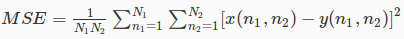.  
The PSNR is defined as 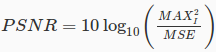, where MAXI is the maximum possible pixel value of the images. For the 8-bit gray-scale images considered in this problem, MAX<sub>I</sub>=255.  
Follow the instructions below to finish this problem.


1. Download the original image from [here](lena.gif). The original image is a 256×256 8-bit gray-scale image.  
2. Convert the original image from type 'uint8' (8-bit integer) to 'double' (real number).  
3. Create a 3×3 low-pass filter with all coefficients equal to 1/9, i.e., create a 3×3 MATLAB array with all elements equal to 1/9.  
4. Low-pass filter the original image (converted to type 'double') with the filter created in step (3). This can be done using the built-in MATLAB function "imfilter". The function "imfilter" takes three arguments and returns one output. The first argument is the original image (converted to type 'double'); the second argument is the low-pass filter created in step (3); and the third argument is a string specifying the boundary filtering option. For this problem, use 'replicate' (including the single quotes) for the third argument. The output of the function "imfilter" is the filtered image.  
5. Compute and record the PSNR value between the original image (converted to type 'double') and the filtered image by using the formulae given above.  
6. Repeat steps (3) through (5) using a 5×5 low-pass filter with all coefficients equal to 1/25. Enter the PSNR values you have obtained from your experiments (The PSNR corresponding to 3×3 filter first, followed by the PSNR corresponding to 5×5 filter). Make sure you order the answers correctly and separate them by a space. Enter the numbers to 2 decimal points.

[X] 29.29 25.73

##Personal notes
Check files:

 * W03Q07.m for matlab code
 * W03Q07.octave.m for gnu octave code, I believe is matlab-compatible
 * W03Q07py for python/scipy code

Scipy needs a little more code, but wasn't easy to find a replacement for ```imfilter``` function. Also need to check the type of filter used.
