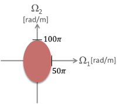
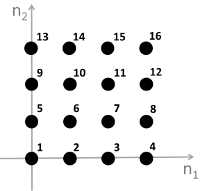
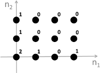

#Question 1
Fast Fourier Transform (FFT) speeds up the computation of the Discrete Fourier Transform (DFT) of a signal by compromising the accuracy of the result

[ ] True 			
[X] False

#Question 2
The continuous image x(t1,t2) has the following frequency spectrum. What is the minimum number of samples that should be taken from any 10cm by 10cm square region on the image to avoid aliasing? 

[ ] 5  
[ ] 25  
[X] 50  
[ ] 100  

##Personal notes
I don't know exactly why it is 50, first time tryied 100 :|

#Question 3
Imagine you want to decrease the resolution of a 1024×1024 pixel image by a factor of 2 in each direction so that you end up with a 512×512 lower resolution image. Which one of the following procedures should you follow?

[ ] low-pass filtering of the original image followed by discarding half of the pixels in the resulting image  
[X] low-pass filtering of the original image followed by discarding three quarters of the pixels in the resulting image  
[ ] high-pass filtering of the original image followed by discarding half of the pixels in the resulting image  
[ ] high-pass filtering of the original image followed by discarding three quarters of the pixels in the resulting image  

##Personal notes
Tought it was discart half of the pixes not 3/4

#Question 4
Imagine now that you want to display a low resolution image on a high resolution TV screen. Which one of the following statements is true?

[ ] This can only be done in the spatial domain where the image is taken.  
[ ] This can only be done in the frequency domain.  
[X] This can be done in the spatial domain.  
[ ] Going from low resolution to high resolution is practically not possible.  

#Question 5
x(n<sub>1</sub>,n<sub>2</sub>) is defined as x(n<sub>1</sub>,n<sub>2</sub>)=(−1)n<sub>1</sub>+n<sub>2</sub> when 0≤n<sub>1</sub>,n<sub>2</sub>≤2 and zero elsewhere. Denote by X(k<sub>1</sub>,k<sub>2</sub>), where 0≤k<sub>1</sub>,k<sub>2</sub>≤2, the DFT of x(n<sub>1</sub>,n<sub>2</sub>). What is the value of X(1,2)?

[ ] 1+j√3  
[ ] 1−j√3  
[X] 4  
[ ] (1+j√3)<sup>2</sup>

##Personal notes
Have no idea where it comes from. From octave:

```matlab
octave:6> img = [1,-1,1; -1,1,-1; 1,-1,1]

img =

   1  -1   1
  -1   1  -1
   1  -1   1

octave:6> fft2(img)
ans =

   1.0000 + 0.0000i   1.0000 + 1.7321i   1.0000 - 1.7321i
   1.0000 + 1.7321i  -2.0000 + 3.4641i   4.0000 + 0.0000i
   1.0000 - 1.7321i   4.0000 - 0.0000i  -2.0000 - 3.4641i
```

**The numeric answer is located in X(2,2), wtf?**

#Question 6
A 4×4 pixel image x(n<sub>1</sub>,n<sub>2</sub>) is depicted below. Denote by X(k<sub>1</sub>,k<sub>2</sub>) the 4×4 point DFT of x(n<sub>1</sub>,n<sub>2</sub>). Calculate X(0,0) 

[X] 136

##Personal note
I did not solve the DFT by hand, use octave instead:

```matlab
img = [1,2,3,4; 5,6,7,8; 9,10,11,12; 13,14,15,16]
fft2(img)

ans =
   136 +   0i    -8 +   8i    -8 +   0i    -8 -   8i
   -32 +  32i     0 +   0i     0 +   0i     0 +   0i
   -32 +   0i     0 +   0i     0 +   0i     0 +   0i
   -32 -  32i     0 -   0i     0 -   0i     0 -   0i

```

#Question 7
Check all statements that are true regarding the 4×3 point DFT of the image x(n1,n2) shown below 

[X] X(k<sub>1</sub>,k<sub>2</sub>) is real  
[ ] X(1,k<sub>2</sub>)=X(2,k<sub>2</sub>) for 0≤k<sub>2</sub>≤2  
[ ] X(k<sub>1</sub>,0)=X(k<sub>1</sub>,2) for 0≤k<sub>1</sub>≤3  
[ ] X(k<sub>1</sub>,k<sub>2</sub>)=X(k<sub>2</sub>,k<sub>1</sub>) for 0≤k<sub>1</sub>,k<sub>2</sub>≤2  
[X] X(0,0)=6  

##Personal note
I did not solve the DFT by hand, use octave instead:

```matlab
img = [2,1,0,1; 1,0,0,0; 1,0,0,0]
fft2(img)

ans =
   6   4   2   4
   3   1  -1   1
   3   1  -1   1
```

#Question 8
In this problem you will get hands-on experience with changing the resolution of an image, i.e., down-sampling and up-sampling. Follow the instructions below to finish this problem.

1. Download the original image from [here](W03Q08IMG00.jpg). The original image is an 8-bit gray-scale image of width 479 and height 359 pixels. Convert the original image from type 'uint8' (8-bit integer) to 'double' (real number).
2. Recall from the lecture that in order to avoid aliasing (e.g., jagged edges) when down-sampling an image, you will need to first perform low-pass filtering of the original image. For this step, create a 3×3 low-pass filter with all coefficients equal to 1/9. Perform low-pass filtering with this filter using the MATLAB function "imfilter" with 'replicate' as the third argument. For more information about low-pass filtering using MATLAB, refer to the programming problem in the homework of Week 2.
3. Obtain the down-sampled image by removing every other row and column from the filtered image, that is, removing the 2nd, 4th, all the way to the 358th row, and then removing the 2nd, 4th, all the way to the 478th column. The resulting image should be of width 240 and height 180 pixles. This completes the procedure for image down-sampling. In the next steps, you will up-sample this low-resolution image to the original resolution via spatial domain processing.
4. Create an all-zero MATLAB array of width 479 and height 359. For every odd-valued i∈[1,359] and odd-valued j∈[1,479], set the value of the newly created array at (i,j) equal to the value of the low-resolution image at ((i+1)/2,(j+1)/2). After this step you have inserted zeros into the low-resolution image.
5. Convolve the result obtained from step (4) with a filter with coefficients [0.25,0.5,0.25;0.5,1,0.5;0.25,0.5,0.25] using the MATLAB function "imfilter". In this step you should only provide "imfilter" with two arguments instead of three, that was the case in step (1). The two arguments are the result from step (4) and the filter specified in this step. This step essentially performs bilinear interpolation to obtain the up-sampled image.
6. Compute the PSNR between the upsampled image obtained from step (5) and the original image. For more information about PSNR, refer to the programming problem in the homework of Week 2. Enter the PSNR you have obtained to two decimal points in the box below.

[X] 28.17
