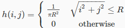

#Information
Hard Deadline: 	Mon 18 May 2015 7:00 AM PDT  
Duration: Untimed  
Attempts: 100  

#Question 1
Applied to a blurred input image, deblurring algorithms A and B result respectively in output images with 20dB and 25dB of ISNR (improvement in signal-to-noise ratio). Which algorithm is better in terms of restored image quality?

**[-]** A  
**[X]** B

#Question 2
Without regularization, we can still solve an image restoration problem and obtain good quality results since the restored image will preserve the fidelity to the data.

**[-]** True  
**[X]** False  

#Question 3
In the spatial domain, the out-of-focus effect can be modeled with an LSI system with impulse response . What is the effect of the system on the image in the frequency domain? Hint: recall that the low-frequency components in an image correspond to the smooth intensity variations, while the high-frequency components correspond to rapid intensity variations, i.e., edges.

**[-]** Mainly low frequency components get suppressed.  
**[X]** Mainly high frequency components get suppressed.  
**[-]** None of the above.  
**[-]** All frequency components get suppressed.  

#Question 4
In the degradation model y(i,j)=x(i,j)+n(i,j), the noise component n(i,j) consists of uncorrelated entries (i.e., the noise entries at two different locations are not correlated with each other). Regarding the distribution of the noise power in the frequency domain, which of the following statements is true?

**[-]** Higher noise power will appear at high frequencies.  
**[-]** Higher noise power will appear at low frequencies.  
**[X]** Noise power will be uniformly distributed over all frequencies.  
**[-]** More information is needed to answer this question.  

#Question 5
The spatially adaptive constrained least-squares restoration filter can potentially implement as many different filters as the number of pixels in the image.

**[X]** True  
**[-]** False

#Question 6
This problems pertains to inverse filtering. You should review the corresponding slides in the video lectures to refresh your memory before attempting this problem.

To help you understand how inverse filter is implemented and applied, we have provided you with a MATLAB script [here](inverse_filtering.m).

Download the script and the [original image](W06Q06IMG00.jpg), and open the script using MATLAB.

Once you open the script, you will see on Line 8 the statement "T = 1e-1". This defines the threshold value used in the inverse filter. The script simulates the blur due to motion and applies inverse filtering for its removal. We encourage you to try different values of the threshold and see how it affects the performance of the inverse filter.

We ask you to enter the ISNR value below when the threshold is set to 0.5. Make sure you enter the number with at least 2 decimal points.

**[X]** 2.86